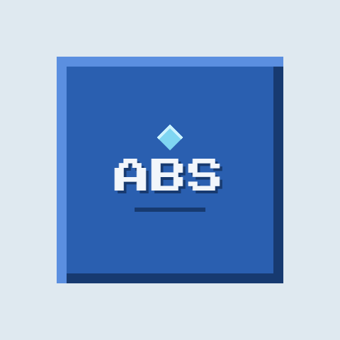

# ABS

<p align="center">
  
</p>

<p align="center"><strong>Azures Bot Service</strong></p>

<p align="center">
  A lightweight Minecraft bot for continuous operation on Render.
</p>

<p align="center">
  <a href="https://github.com/AzureMC-projects/ABS/actions"></a>
  <a href="https://github.com/AzureMC-projects/ABS/blob/main/LICENSE"></a>
  <a href="https://nodejs.org/"></a>
</p>

**ABS (Azures Bot Service)** automatically connects to a Minecraft server, reconnects after disconnects, requests respawn after death, and continuously walks while the service is running.

---

## Features

- 🤖 Automatic Minecraft server connection
- 🔄 Automatic reconnection after disconnects
- ♻️ Automatic respawn handling
- 🚶 Continuous walking with occasional jumping
- ☁️ Designed for Render Web Services
- ❤️ Health endpoint for service monitoring
- 📊 JSON status endpoint with uptime and reconnect count
- ⚙️ Environment-variable configuration
- 🛡️ GitHub Actions validation and Dependabot updates

---

## Setup

### 1. Fork this repository

If you are setting up your own copy of ABS:

1. Click **Fork** on GitHub.
2. Select your GitHub account.
3. Use your fork for the Render deployment.

If you already own the repository, you can skip this step.

### 2. Create a Render Web Service

Open Render and:

1. Click **New +**
2. Select **Web Service**
3. Connect your GitHub repository
4. Choose the **ABS** repository
5. Give your service a name
6. Set the build command to:

```bash
npm install
```

7. Set the start command to:

```bash
npm start
```

### 3. Configure environment variables

In your Render service, open **Environment Variables** and add the following:

| Variable | Required | Default | Description |
|---|:---:|---|---|
| `MC_HOST` | **Yes** | — | Minecraft server address |
| `MC_PORT` | No | `25565` | Minecraft server port |
| `MC_USERNAME` | **Yes** | — | Minecraft bot username |
| `MC_AUTH` | No | `offline` | Authentication mode |
| `MC_VERSION` | No | auto | Minecraft version |
| `RECONNECT_MS` | No | `5000` | Reconnect delay in milliseconds |
| `WALK_INTERVAL_MS` | No | `1000` | Walking interval in milliseconds |

For a basic setup:

```text
MC_HOST=your-server-ip
MC_PORT=25565
MC_USERNAME=your-bot-name
```

### 4. Deploy

Click **Create Web Service** in Render.

Render will install the dependencies and start ABS automatically.

Once the service is running, open the **Logs** section in Render to check the bot's connection status.

---

## Monitoring

ABS exposes two simple HTTP endpoints:

- `/` — JSON service information, connection status, server, uptime, and reconnect count.
- `/health` — lightweight health response suitable for monitoring.

Example:

```text
GET /health
```

---

## How ABS works

Once started, ABS will:

1. Validate the required configuration.
2. Connect to the configured Minecraft server.
3. Start walking after joining.
4. Request a respawn after death.
5. Reconnect if the connection is lost.
6. Continue operating while the Render service is running.

ABS cannot prevent a Minecraft server from kicking, banning, blocking, or shutting down the bot.

---

## Documentation

- [Configuration](docs/configuration.md)
- [Troubleshooting](docs/troubleshooting.md)
- [Contributing](CONTRIBUTING.md)
- [Security](SECURITY.md)
- [Changelog](CHANGELOG.md)
- [Trademark guidance](TRADEMARKS.md)

---

## Microsoft authentication

If your Minecraft server requires Microsoft authentication, set:

```text
MC_AUTH=microsoft
```

**Never put passwords, access tokens, or other private credentials in GitHub.**

---

## Development

Install dependencies and run the syntax check:

```bash
npm install
npm run check
```

Start the service locally:

```bash
MC_HOST=your-server-ip MC_USERNAME=your-bot-name npm start
```

---

## Using ABS in your own projects

ABS is primarily developed and tested for **Paper 26.3**. Other Minecraft server software or versions may work, but are not the primary compatibility target.

ABS is licensed under the **Apache License 2.0**.

You may use, modify, and deploy ABS in your own projects and services, including commercial or hosted services, provided you comply with the license.

You may **not**:

- Claim that you created the original ABS project.
- Present your project or service as the official ABS service.
- Use ABS branding in a way that implies endorsement or official affiliation with AzureMC-projects.
- Market your service as an official ABS service without permission.

You may describe your project as **using ABS** or **being based on ABS** when that is accurate.

For the full branding rules, see [TRADEMARKS.md](TRADEMARKS.md).

---

## License

ABS is licensed under the [Apache License 2.0](LICENSE).

Copyright © 2026 AzureMC-projects.

---

## Disclaimer

ABS is provided as-is. You are responsible for ensuring that your use of ABS complies with the rules of the Minecraft server, hosting provider, and any other services you use.

Only use ABS on servers that permit automated bots.


## Compatibility

ABS is primarily developed and tested for **Paper 26.3**. See the [compatibility guide](docs/compatibility.md) for the current support target and reporting guidance.

## Local configuration

For local development, start from [`.env.example`](.env.example) and never commit real credentials.

## Docker

ABS includes a production Dockerfile. See [`docs/docker.md`](docs/docker.md) for build and run instructions.

## Roadmap

See [`ROADMAP.md`](ROADMAP.md) for planned improvements.
